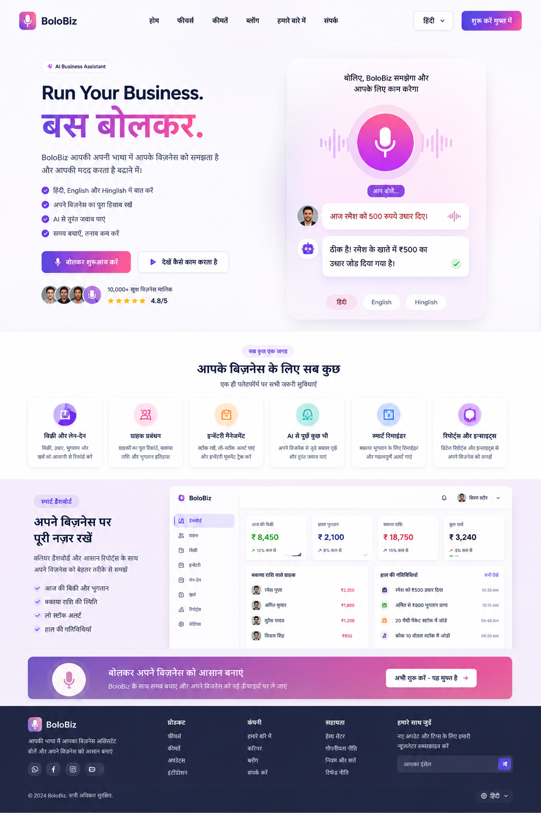
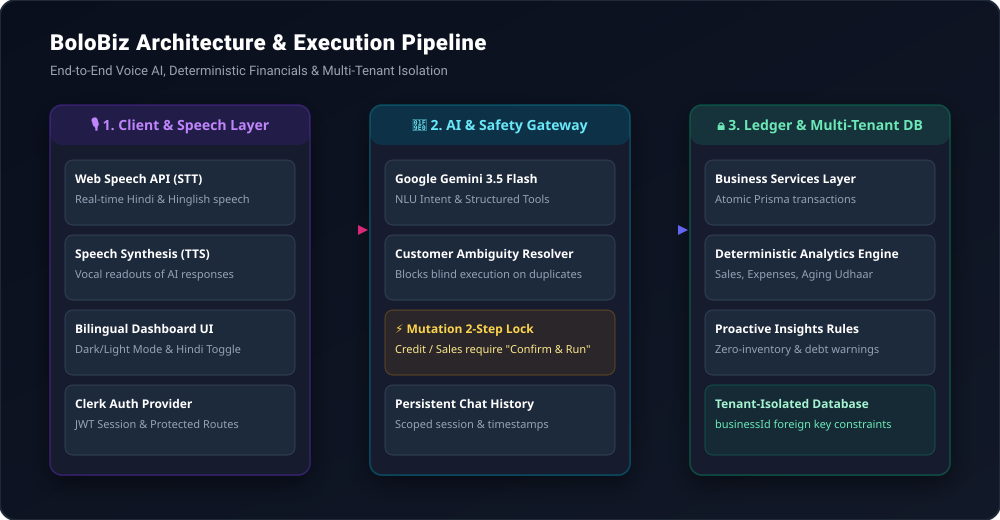

<div align="center">

# 🎙️ BoloBiz — Voice-First AI Kirana Business OS

**बोलिए और अपना व्यापार संभालिए • "Bolo, Kaam Ho Gaya"**

*An intelligent, voice-first operating system designed for Indian Kirana stores and micro-merchants.*

[](https://nextjs.org/)
[](https://react.dev/)
[](https://www.typescriptlang.org/)
[](https://ai.google.dev/)
[](https://clerk.com/)
[](https://www.prisma.io/)
[](LICENSE)

<br />



</div>

---

## 🌟 Overview

**BoloBiz** solves the digital adoption barrier for millions of small retail shop owners (*Kirana* stores) across India. Instead of navigating complex accounting software or manual paper ledgers (*Bahi-Khata*), merchants can speak naturally in **Hindi, Hinglish, or English**. 

BoloBiz captures voice intents, resolves ambiguous customer records, requests explicit confirmations before modifying financial balances, and delivers deterministic business intelligence analytics in real-time.

---

## 🚀 Key Highlights & Capabilities

### 🎙️ 1. Voice-First Multilingual Assistant
- **Continuous Speech Recognition**: Uses the browser Web Speech API with real-time audio visualization waveforms. Captured speech is automatically submitted as a chat bubble without losing transcripts.
- **Hindi & Hinglish Fluency**: Understands natural retail phrasing such as:
  - *"रमेश को 500 का उधार लिखो"*
  - *"Suresh ne 200 rupaye jama kiye"*
  - *"Aaj ki total bikri aur kharche kitne hain?"*
- **Speech Synthesis (TTS)**: Reads out confirmation summaries in natural Indian voice accents.
- **Persistent Scoped History**: Stores conversation sessions per business tenant with timestamps, allowing merchants to start fresh sessions (**➕ New Chat**) or delete history with safety prompts (**🗑️ Clear Chat**).

### ⚡ 2. Financial Safety Lock & 2-Step Confirmation
- **No Hallucinated Calculations**: LLMs are strictly forbidden from performing mathematical accounting. All figures are computed deterministically on the server.
- **Explicit Mutation Receipts**: Financial mutations (`CREDIT`, `PAYMENT`, `EXPENSE`, `INVENTORY_ADD`) generate an interactive receipt confirmation card requiring merchant approval (**"Confirm & Run"**) before committing to the database.

### 📊 3. Business Intelligence & Proactive Insights
- **Core Financial Metrics**:
  - **Today's Sales** (Cash + Credit sales).
  - **Today's Expenses** (Operational costs).
  - **Sales after Expenses** (Deterministic net liquidity).
  - **Total Outstanding Udhaar** (Sum of all customer balances).
- **Interactive Visualizations**: 7-day sales trend charts, debtor credit aging breakdown (0–15 days, 16–30 days, 30+ days), and safety stock alerts.
- **Getting Started Guide**: Smooth onboarding for brand-new stores that automatically transitions to the live BI dashboard upon recording the first transaction.

### 👥 4. Smart Khata & Ambiguity Resolution
- **Duplicate Customer Protection**: If multiple customers share the same name (e.g., two *"Ramesh Patel"*), BoloBiz returns an `AMBIGUOUS` prompt displaying partially masked phone numbers (e.g., `98765XXXXX`) so the merchant selects the exact customer.

### 📦 5. Real-Time Inventory Management
- **Safety Stock Triggers**: Flags items dropping below configurable minimum threshold limits.
- **Quick Restocking**: Instant voice or button stock adjustments with atomic Prisma increments.

### 🔒 6. Enterprise-Grade Multi-Tenant Isolation
- Every database query and API endpoint enforces strict `businessId` scoping derived from the server authentication session. One business cannot query, modify, or infer another store's records.

---

## 🏗️ System Architecture & Execution Pipeline

```
Merchant Voice Input (Hindi / Hinglish / English)
                │
                ▼
      [ Web Speech API (STT) ] ──────────► [ Waveform UI ]
                │
                ▼
   [ API Gateway: /api/chat ]
                │
                ▼
  [ Google Gemini 3.5 Flash ] ───────────► 15 Native BoloBiz Tools
                │
         Is Financial Write?
         ┌──────┴──────┐
        YES            NO
         │             │
         ▼             ▼
[ 2-Step Confirmation ] [ Deterministic Analytics Engine ]
  "Confirm & Run" Card          (src/lib/services/analytics.ts)
         │                               │
         ▼                               ▼
 [ Atomic Prisma Transactions ] ◄────────┘
         │
         ▼
[ Multi-Tenant Database (SQLite / Postgres) ]
         │
         ▼
[ Web Speech Synthesis (TTS Response) ]
```

<br />



---

## 🗣️ Voice Commands in Action

| Merchant Says (Voice / Text) | Action Performed | Safety Mechanism |
| :--- | :--- | :--- |
| **"रमेश को ₹600 का उधार लिखो"** | Records ₹600 Udhaar to Ramesh | Confirmation card with updated balance |
| **"सुरेश ने ₹250 जमा किए"** | Records payment and deducts debt | Displays remaining balance before commit |
| **"आज की कुल बिक्री और खर्च बताओ"** | Calculates today's cash flow | Deterministic server calculation |
| **"मैगी के 50 पैकेट जोड़ो"** | Increases Maggi stock by 50 units | Validates product SKU and threshold |
| **"किस ग्राहक का सबसे ज्यादा उधार है?"** | Analyzes customer khata ledger | Returns highest debtor with exact amount |
| **"दुकान में कौन सा सामान खत्म हो रहा है?"** | Inspects safety inventory levels | Lists low-stock products with units left |

---

## 🛠️ Technology Stack

| Category | Technologies |
| :--- | :--- |
| **Framework** | [Next.js 15](https://nextjs.org/) (App Router, Server Actions, Route Handlers) |
| **Frontend** | [React 19](https://react.dev/), Vanilla CSS Variables, Glassmorphism, Responsive CSS Grid |
| **AI & LLM** | [Google Gemini 3.5 Flash](https://ai.google.dev/) via `@google/generative-ai` with 15 Structured Tools |
| **Voice Engine** | Web Speech API (`webkitSpeechRecognition` & `SpeechSynthesis`) |
| **Authentication** | [Clerk](https://clerk.com/) (`@clerk/nextjs`) with automated store provisioning |
| **Database & ORM** | [Prisma 6.0](https://www.prisma.io/) with SQLite (local dev) / PostgreSQL (production ready) |
| **Type Safety** | [TypeScript 5](https://www.typescriptlang.org/) |

---

## 📂 Project Structure

```
BoloBiz/
├── assets/                           # Screenshots, preview images & SVG diagrams
│   ├── BoloBiz.png
│   ├── dashboard_preview.png
│   └── architecture_flow.svg
├── prisma/
│   ├── schema.prisma                 # Multi-tenant schema (Business, User, Customer, Product, Transaction, Chat)
│   └── dev.db                        # SQLite database
├── src/
│   ├── app/
│   │   ├── api/                      # REST & AI Route Handlers
│   │   │   ├── chat/route.ts         # Persistent Chat & Gemini Tool Execution
│   │   │   ├── customers/route.ts    # Customer CRUD API
│   │   │   ├── dashboard/            # Stats, Insights, and Store Setup APIs
│   │   │   ├── products/route.ts     # Inventory Management API
│   │   │   └── transactions/route.ts # Financial Ledger API
│   │   ├── dashboard/                # Merchant Dashboard Pages
│   │   │   ├── assistant/page.tsx    # AI Voice Assistant Interface
│   │   │   ├── customers/page.tsx    # Customer Khata Ledger
│   │   │   ├── inventory/page.tsx    # Stock & Safety Inventory
│   │   │   ├── settings/page.tsx     # Store Profile & Password Settings
│   │   │   ├── transactions/page.tsx # Audit Trail & Transaction Logs
│   │   │   ├── layout.tsx            # Protected Sidebar Navigation
│   │   │   └── page.tsx              # BI Overview & Getting Started Guide
│   │   ├── login/page.tsx            # Sign In Portal
│   │   ├── signup/page.tsx           # Sign Up & Store Creation
│   │   ├── globals.css               # Design System (Dark/Light Mode Variables)
│   │   ├── layout.tsx                # Root Theme & Clerk Provider
│   │   └── page.tsx                  # High-Converting Landing Page
│   ├── components/
│   │   ├── landing/                  # Modular Landing Page Sections
│   │   └── ThemeToggle.tsx           # Floating Dark/Light Mode Switcher
│   ├── hooks/
│   │   ├── useVoiceRecognition.ts    # Speech Recognition with auto-submit
│   │   └── useVoiceSynthesis.ts      # Multilingual Text-to-Speech Output
│   ├── lib/
│   │   ├── ai/
│   │   │   ├── ai-service.ts         # Gemini Orchestrator & Tool Call Router
│   │   │   └── tools.ts              # 15 Native Ledger & Query Tools
│   │   ├── services/
│   │   │   ├── analytics.ts          # Deterministic Math & Financial Aggregation
│   │   │   └── business.ts           # Customer, Product & Transaction Ledger
│   │   ├── auth.ts                   # Auth Session & Tenant Resolver
│   │   └── db.ts                     # Prisma Database Client Singleton
│   └── middleware.ts                 # Clerk Authentication Route Guard
├── package.json
├── tsconfig.json
└── README.md
```

---

## ⚡ Getting Started

### Prerequisites
- **Node.js**: v18.17.0 or higher
- **npm** or **pnpm** / **yarn**
- **Clerk Account**: Free account for authentication keys at [clerk.com](https://clerk.com)
- **Google Gemini API Key**: Free API key from [Google AI Studio](https://aistudio.google.com/)

### 1. Clone the Repository
```bash
git clone https://github.com/jyotidxt/BoloBiz.git
cd BoloBiz
```

### 2. Install Dependencies
```bash
npm install
```

### 3. Configure Environment Variables
Create a `.env` file in the root directory:

```env
# Database URL (SQLite default, or PostgreSQL)
DATABASE_URL="file:./dev.db"

# Google Gemini API
GEMINI_API_KEY="your_gemini_api_key_here"

# Clerk Authentication Keys
NEXT_PUBLIC_CLERK_PUBLISHABLE_KEY="pk_test_..."
CLERK_SECRET_KEY="sk_test_..."
NEXT_PUBLIC_CLERK_SIGN_IN_URL="/login"
NEXT_PUBLIC_CLERK_SIGN_UP_URL="/signup"
NEXT_PUBLIC_CLERK_AFTER_SIGN_IN_URL="/dashboard"
NEXT_PUBLIC_CLERK_AFTER_SIGN_UP_URL="/dashboard"
```

### 4. Push Database Schema
```bash
npx prisma db push
```

### 5. Run Development Server
```bash
npm run dev
```

Open [http://localhost:3000](http://localhost:3000) in your browser.

---

## 🧪 Verification & Automated Audits

BoloBiz includes automated test suites covering multi-tenant isolation, customer ambiguity resolution, ledger accuracy, and chat persistence:

```bash
# Run persistent chat & tenant isolation tests
npx tsx scratch/test-persistent-chat.ts

# Run end-to-end production readiness audit
npx tsx scratch/v1-production-audit.ts

# Production build validation
npm run build
```

---

## 🌓 Dark & Light Mode Support

BoloBiz features a glassmorphic design system with adaptive CSS variables. Merchants can toggle between Light and Dark themes via the floating switch in the bottom-right corner. All text colors, receipt cards, and table headers dynamically adjust for readability.

---

## 🤝 Contributing

Contributions, issues, and feature requests are welcome! Feel free to check the [issues page](https://github.com/jyotidxt/BoloBiz/issues).

1. Fork the repository
2. Create your feature branch (`git checkout -b feature/AmazingFeature`)
3. Commit your changes (`git commit -m 'Add some AmazingFeature'`)
4. Push to the branch (`git push origin feature/AmazingFeature`)
5. Open a Pull Request

---

## 📄 License

This project is licensed under the MIT License — see the [LICENSE](LICENSE) file for details.

---

<div align="center">
  <sub>Built with ❤️ for Indian small business owners and Kirana merchants.</sub>
</div>
